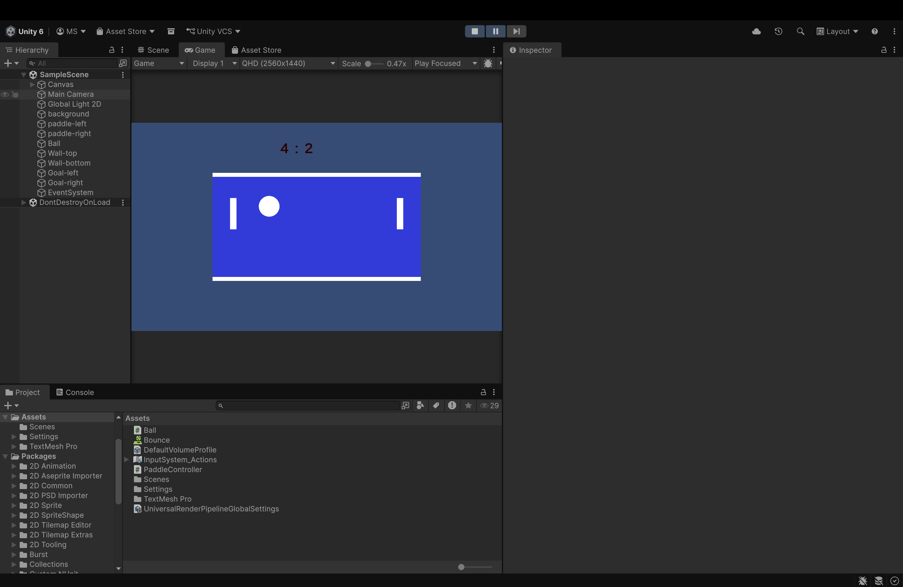
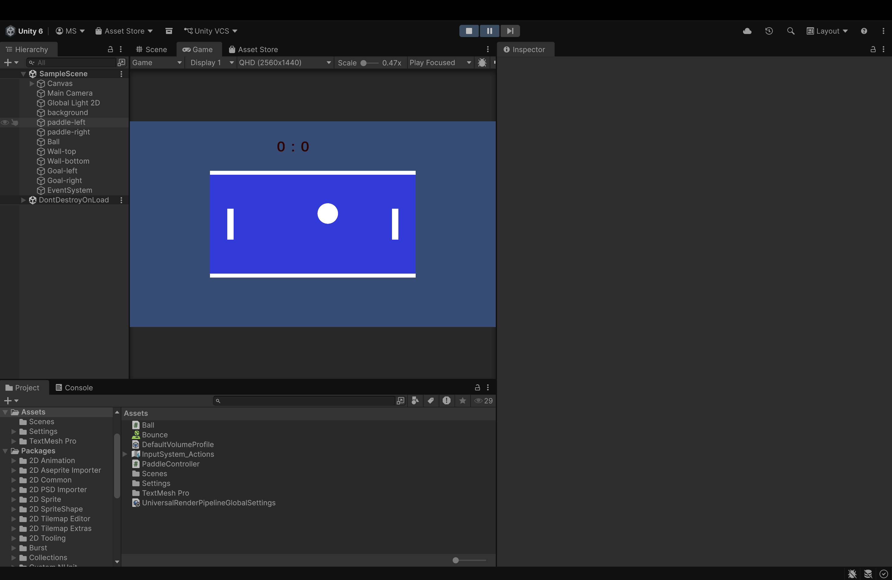

# Pong Game (Unity)

## Description
A simple Pong game built using Unity as part of the 20 Games Challenge.

## Features
- Two paddle controls
- Ball physics and collision
- Score system
- Win condition (first to 5)

## Controls
- Player 1: W / S
- Player 2: Arrow Keys

## What I Learned
- Basics of Unity game development
- Player movement and input handling
- Collision and physics
- UI implementation (score system)
- Game logic and win conditions

## Challenges Faced
- Fixing input system issues
- Setting up proper collision and bounce
- Making UI visible and updating correctly
- Implementing scoring and win logic

## Screenshots

### Gameplay

### Win Screen

